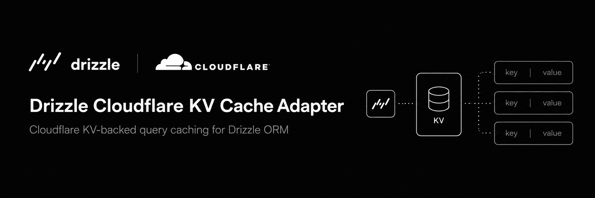

Available on npm as [`drizzle-cloudflare-kv-cache-adapter`](https://www.npmjs.com/package/drizzle-cloudflare-kv-cache-adapter).

A [Cloudflare KV](https://developers.cloudflare.com/kv/)-backed implementation of Drizzle ORM's [cache](https://orm.drizzle.team/docs/cache) interface. It caches read-heavy Drizzle queries at the edge using the KV namespace you already have bound to your Worker.

:::note
This is **not** a database driver. It only implements Drizzle's query cache layer — `.$withCache()` and `db.$cache.invalidate(...)`.
:::

## Why

Drizzle's cache layer ships with a Redis/Upstash adapter out of the box. On Cloudflare Workers + D1 you usually don't want to add a Redis dependency just to cache a few hot queries. KV is already there, globally replicated, and free-tier friendly — so use it.

## When it fits

- Read-heavy queries that tolerate brief staleness (config, catalogs, public profiles).
- Workers / D1 apps that want caching without new infrastructure.
- Anything where a 60-second-or-more TTL is acceptable.

## When it does **not** fit

- Read-after-write strong consistency. KV is eventually consistent.
- Sub-60-second freshness. KV enforces a 60s minimum TTL.
- Per-row caching with high write churn — invalidation is table-scoped.

## Requirements

- `drizzle-orm >= 0.44.0`
- A bound `KVNamespace` in your Worker (`env.CACHE` or similar).

## Disclaimer

This is an independent, community-maintained project. It is **not affiliated with, endorsed by, or sponsored by** Drizzle ORM or Cloudflare, Inc. "Drizzle", "Cloudflare", "Cloudflare Workers", "Workers KV", and "D1" are trademarks of their respective owners and are used here for identification purposes only.
